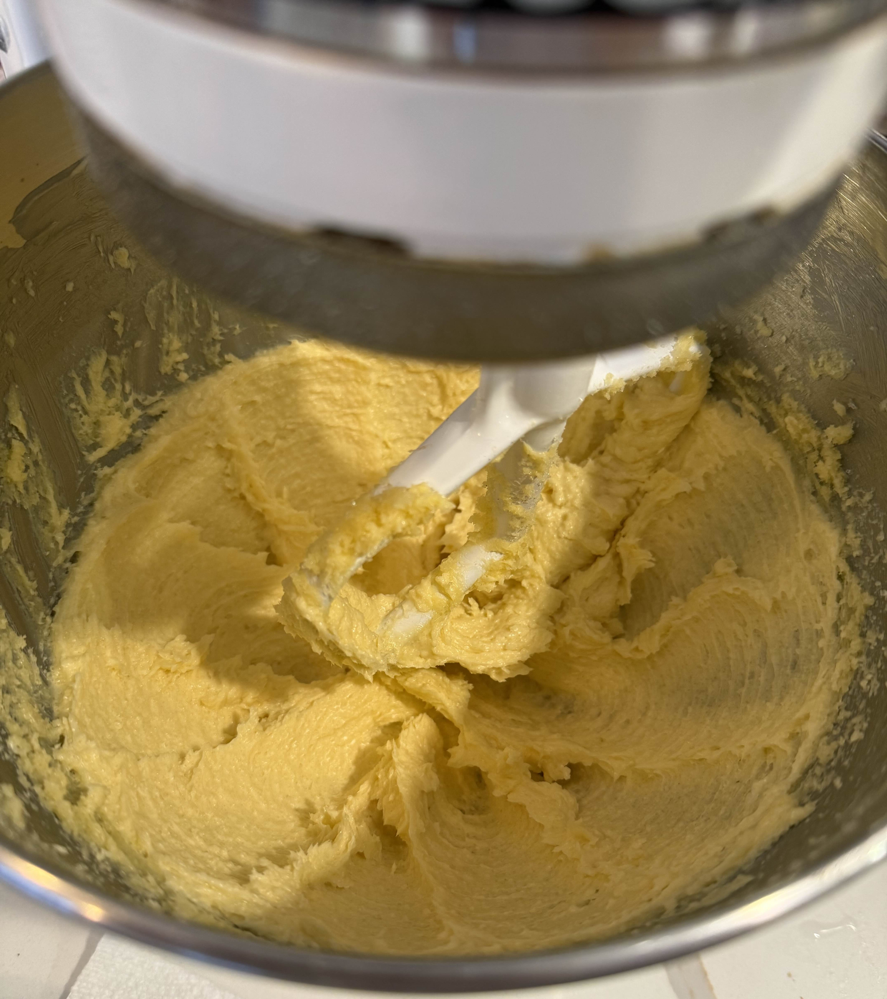
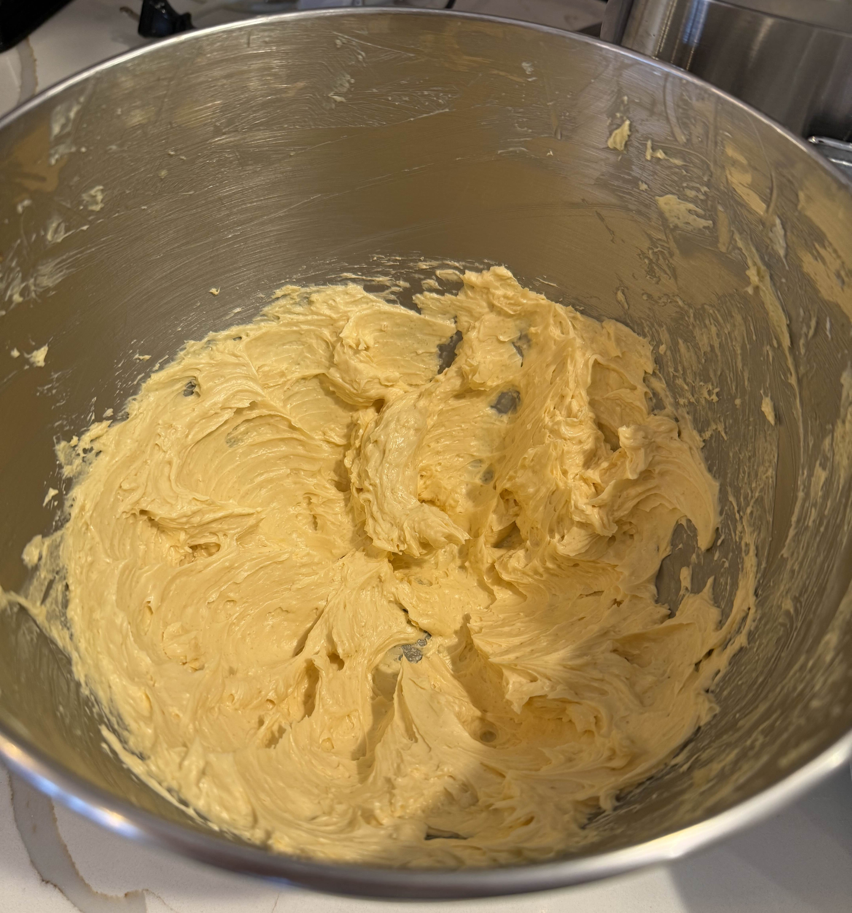
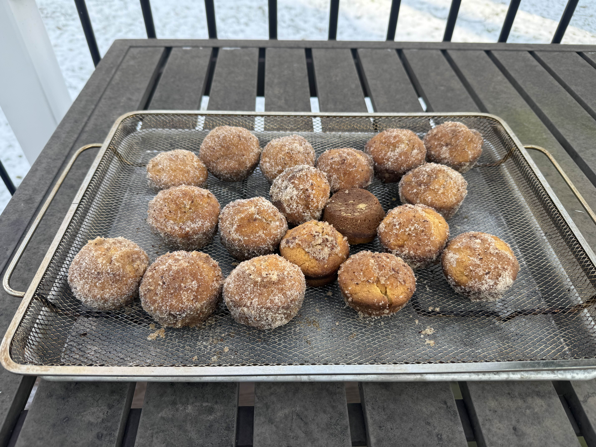
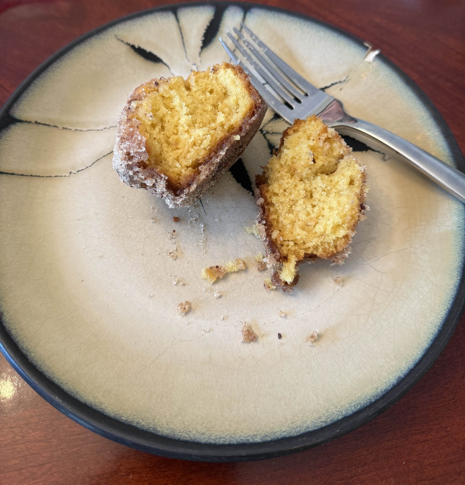
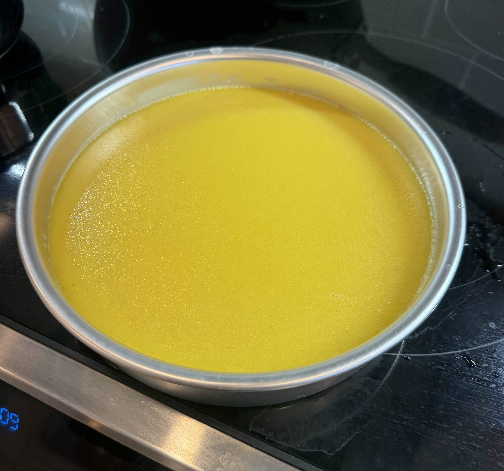
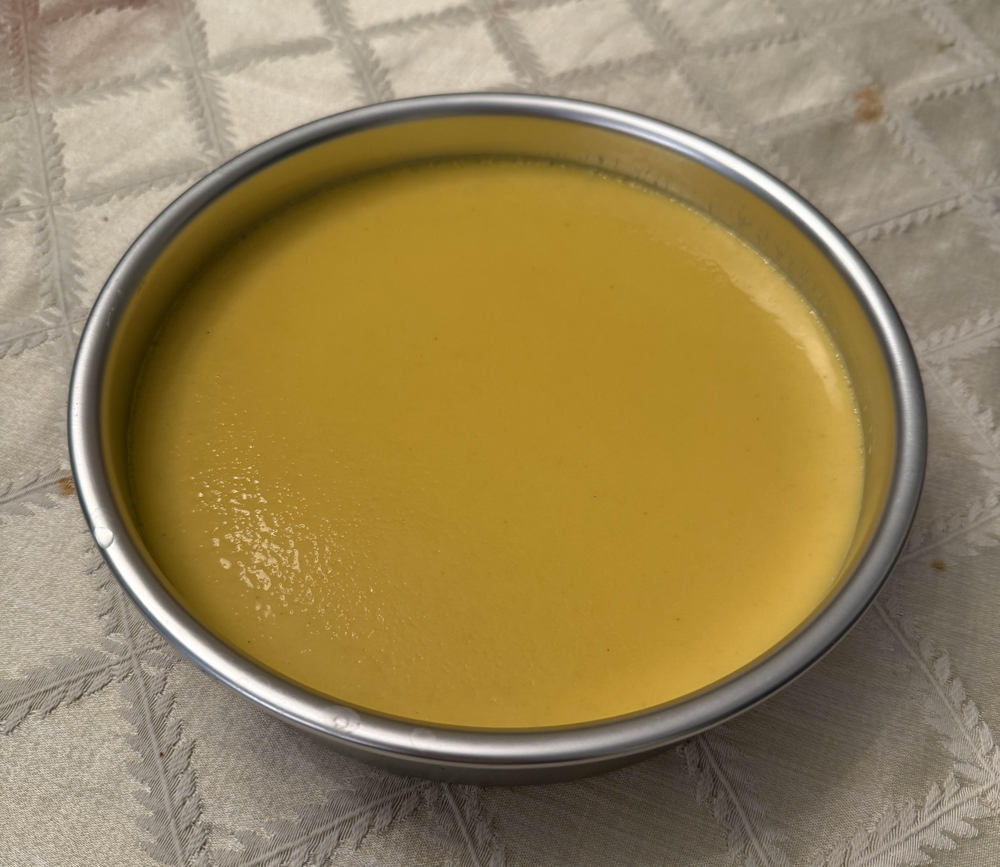
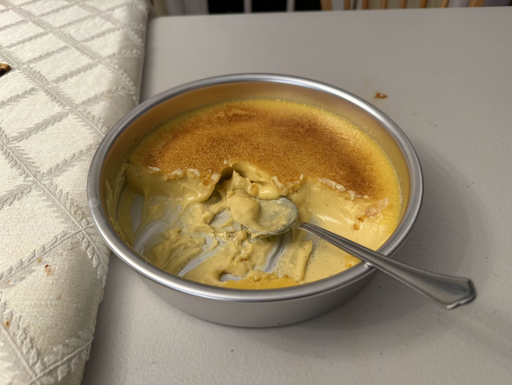

My first baking post! I am sharing some baking I did on New Year's Eve. I was staying with family so had a big audience. 

## Dirt Bombs

I made dirt bombs (muffins with a similar texture and flavor to cake donuts) following [Claire Saffitz's video](https://youtu.be/H9fbzzu1bPE?si=kE3YyfWwzjyOnAw5). I only had salted butter on hand so omitted the salt from the batter and the muffins themselves tasted well-seasoned. I also used salted butter for the melted butter that the muffins were dipped in after baking, and it seemed to temper the sweetness of the cinnamon sugar significantly. Next time I would use unsalted butter for dipping to increase the sweetness level. Overall the dirt bombs turned out great. The crumb was very tender and it really evoked cake donut without requiring frying or a donut mold. The recipe was straightforward and easy to execute on a holiday morning to make breakfast for a crowd. I also had one the next morning (microwaved it briefly) and it was still good, so you can probably make this for a smaller group and enjoy the muffins for a few days.   
  
<figure>
      
    <figcaption> The butter early in the creaming process. </figcaption>
</figure>

<figure>
      
    <figcaption> The creamed butter and eggs mixture. </figcaption>
</figure>

<figure>
      
    <figcaption> The muffin tin filled with batter. </figcaption>
</figure>

<figure>
      
    <figcaption> The completed dirt bombs. I ran out of cinnamon sugar towards the end. </figcaption>
</figure>

<figure>
      
    <figcaption> A dirt bomb split open. </figcaption>
</figure>

## Colossal Crème Brûlée

For dinner dessert, I spontaenously decided to make a large [crème brûlée](https://www.bonappetit.com/recipe/colossal-creme-brulee) because it's quick but elegant and I did not have individual ramekins. I used an 8-inch round aluminum cake pan. This was my first time making crème brûlée. The custard was simple but took around 20 minutes longer than expected to set in the oven, possibly because I boiled the water for the water bath in advance and it had cooled down slightly when I put the pans in the oven.  

<figure>
      
    <figcaption> The custard fresh out of the oven. </figcaption>
</figure>  

<figure>
      
    <figcaption> The custard after it had cooled down. </figcaption>
</figure>  

I was a bit nervous about caramelizing the sugar so experimented with it on foil. I discovered that organic cane sugar was prone to burning due to its larger crystal size and small amount of molasses, and used regular granulated sugar instead (see [this article](https://www.177milkstreet.com/stories/03-2024-best-sugar-for-creme-brulee) for more information). I held the torch pretty far from the sugar to avoid burning it, so it took longer to melt and caramelize the sugar but we got there eventually. This warmed up the custard so I returned it to the fridge to chill, and I did find the cold custard to taste better contrasted against the crunchy topping. With more experience I will caramelize the sugar more rapidly in the future. The final result was delicious; the large format was dramatic and great for a celebration. 

<figure>
      
    <figcaption> The Crème Brûlée. </figcaption>
</figure>  

<figure>
      
    <figcaption> The Crème Brûlée, half-eaten. </figcaption>
</figure> 

Happy new year! 